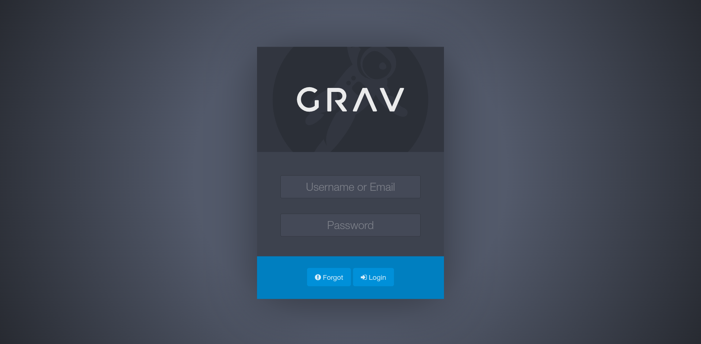
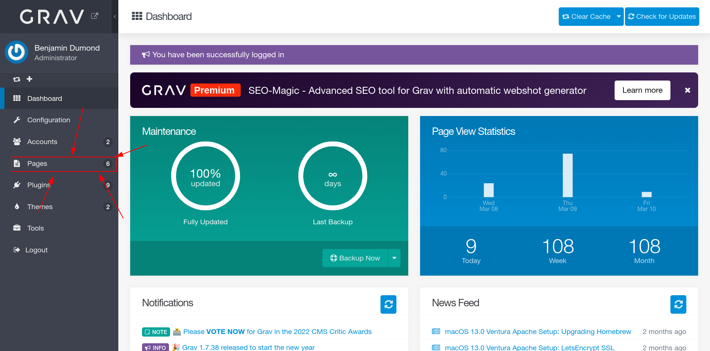
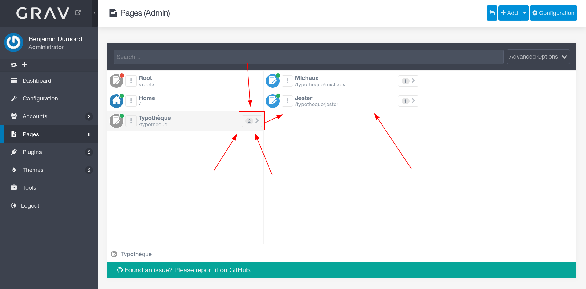
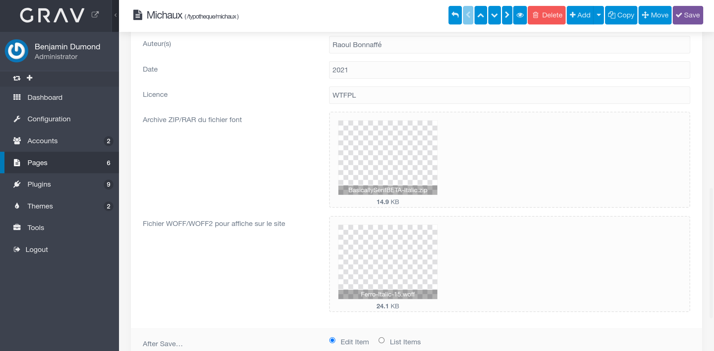
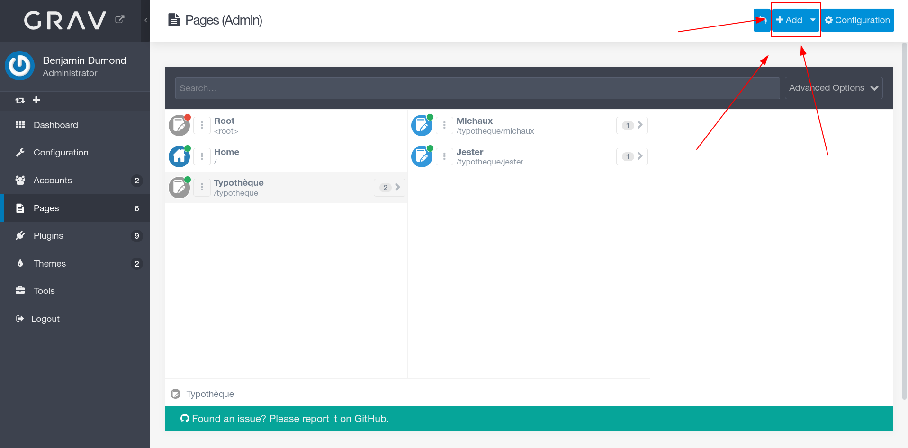
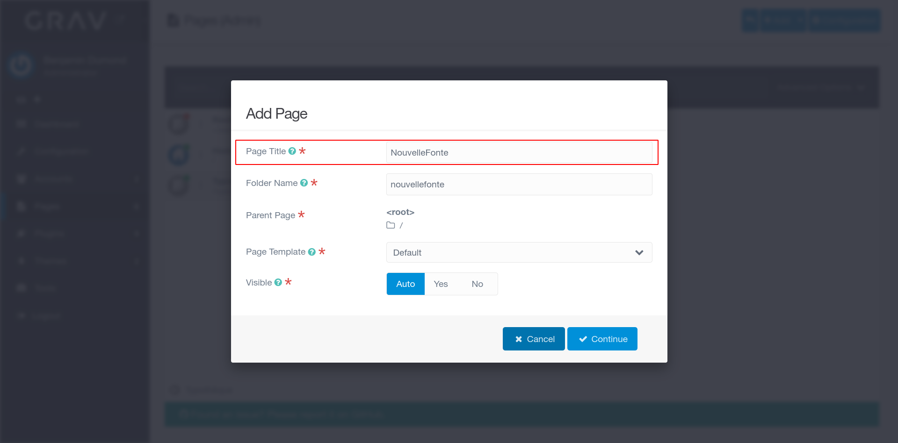
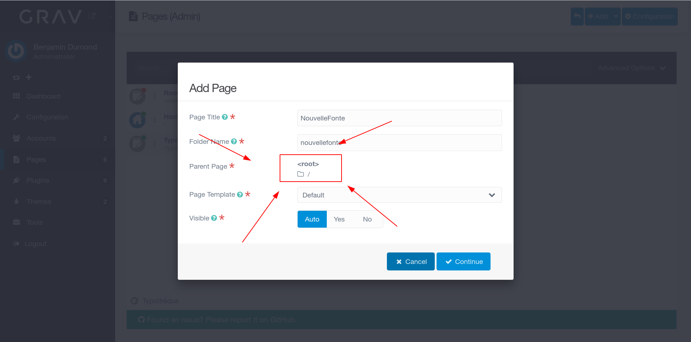
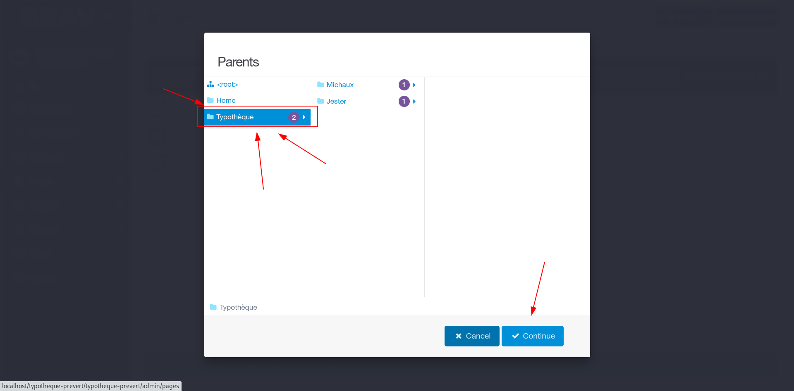
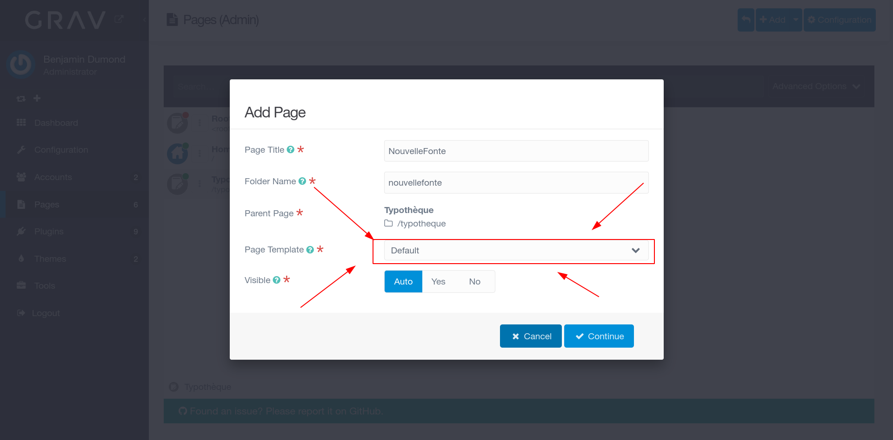
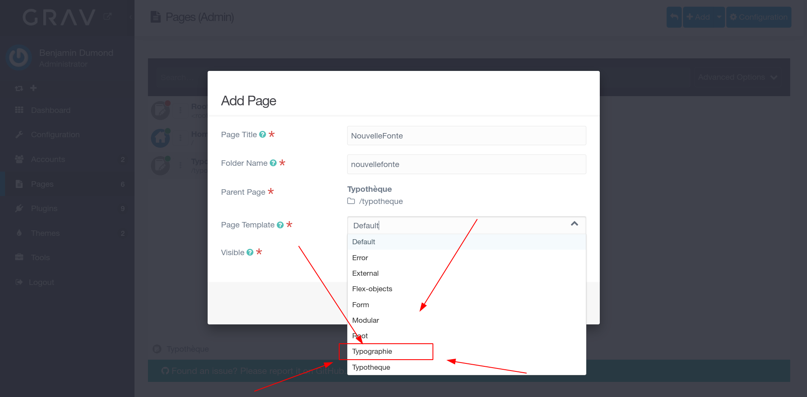

# Grav de la Typothèque

Repertoire du site de la typothèque.

### Tutoriel pour ajouter une fonte
Dans un premier temps, il faut aller sur l'url du site en ajouter "/admin" a la fin de l'url pour arriver à la page de log. Entrez votre login et mot de passe.

Dans un premier temps, il faut aller sur l'url du site en ajouter "/admin" a la fin de l'url pour arriver à la page de log. Entrez votre login et mot de passe.

Dans un premier temps, il faut aller sur l'url du site en ajouter "/admin" a la fin de l'url pour arriver à la page de log. Entrez votre login et mot de passe.

Dans un premier temps, il faut aller sur l'url du site en ajouter "/admin" a la fin de l'url pour arriver à la page de log. Entrez votre login et mot de passe.

Dans un premier temps, il faut aller sur l'url du site en ajouter "/admin" a la fin de l'url pour arriver à la page de log. Entrez votre login et mot de passe.

Dans un premier temps, il faut aller sur l'url du site en ajouter "/admin" a la fin de l'url pour arriver à la page de log. Entrez votre login et mot de passe.

Dans un premier temps, il faut aller sur l'url du site en ajouter "/admin" a la fin de l'url pour arriver à la page de log. Entrez votre login et mot de passe.

Dans un premier temps, il faut aller sur l'url du site en ajouter "/admin" a la fin de l'url pour arriver à la page de log. Entrez votre login et mot de passe.

Dans un premier temps, il faut aller sur l'url du site en ajouter "/admin" a la fin de l'url pour arriver à la page de log. Entrez votre login et mot de passe.

Dans un premier temps, il faut aller sur l'url du site en ajouter "/admin" a la fin de l'url pour arriver à la page de log. Entrez votre login et mot de passe.

Dans un premier temps, il faut aller sur l'url du site en ajouter "/admin" a la fin de l'url pour arriver à la page de log. Entrez votre login et mot de passe.

Dans un premier temps, il faut aller sur l'url du site en ajouter "/admin" a la fin de l'url pour arriver à la page de log. Entrez votre login et mot de passe.
