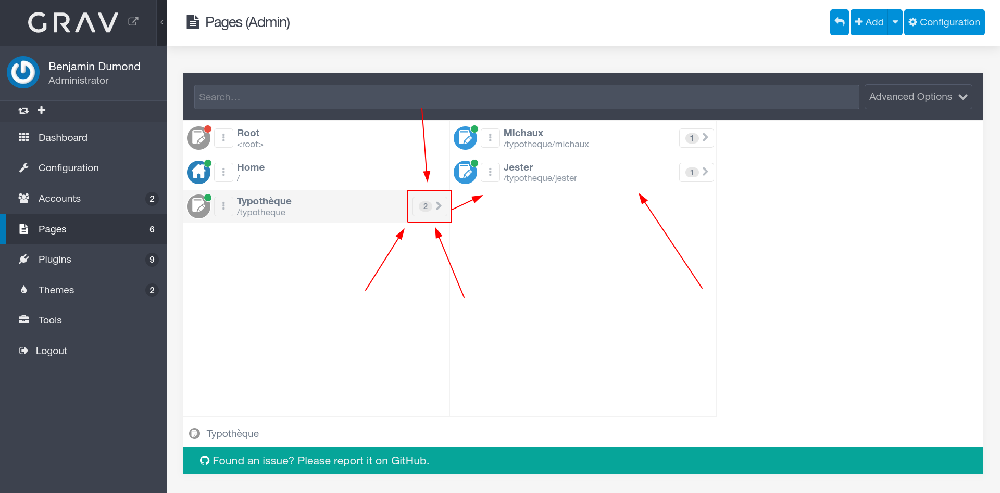
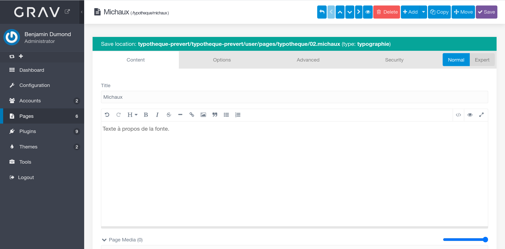
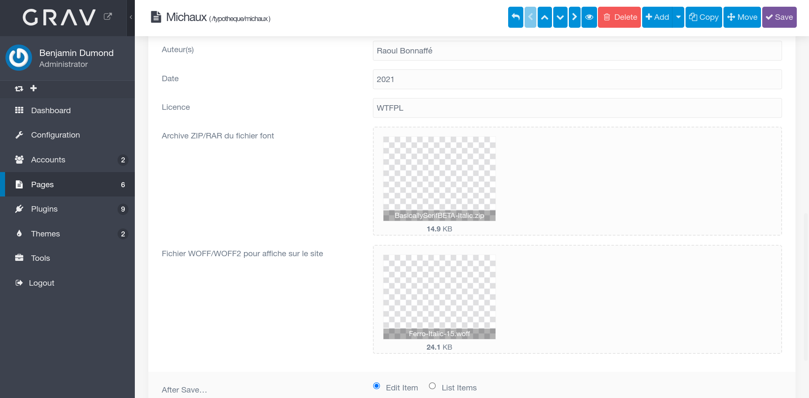
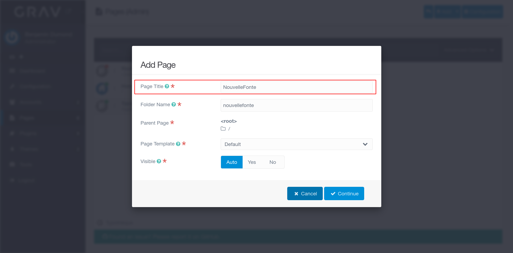
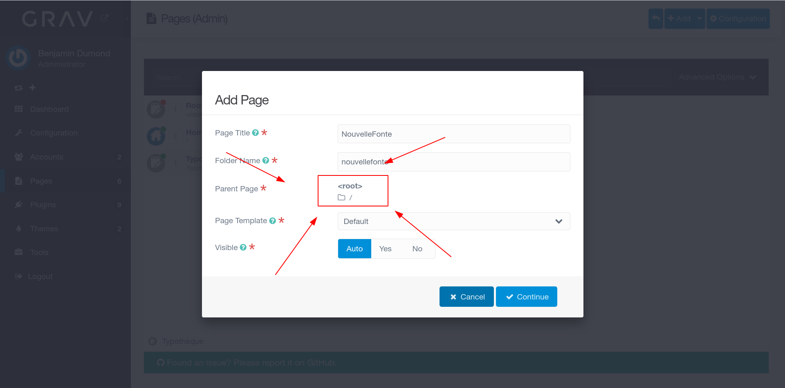
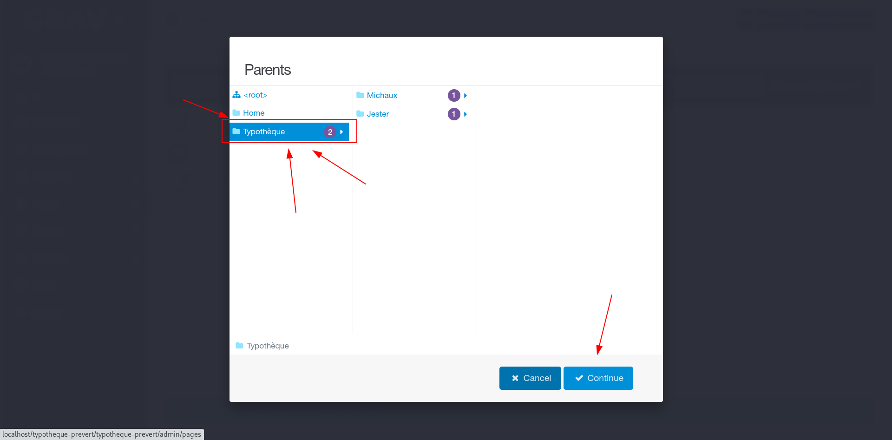
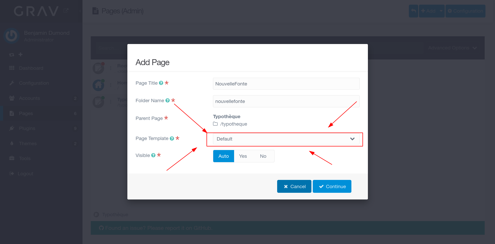
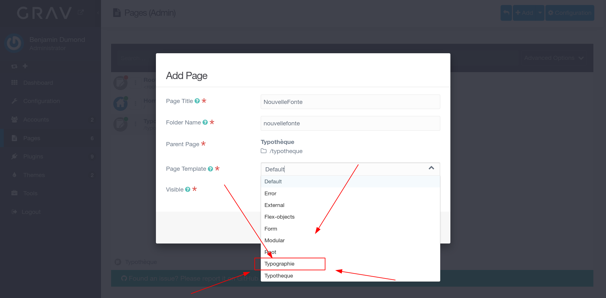

# Grav de la Typothèque

Repertoire du site de la typothèque.

### Tutoriel pour ajouter/modifier une fonte
Dans un premier temps, il faut aller sur l'url du site en ajouter "/admin" a la fin de l'url pour arriver à la page de log. Entrez votre login et mot de passe.

En arrivant sur la page d'accueil de l'admin, cliquez sur "Pages" pour aller dans la section d'ajout/modification de pages.

Si vous cliquez sur le petit chiffre à côté de "Typothèque", vous verrez apparaitre dans la colone de droite toutes les fontes déjà ajoutées.

En cliquant sur le nom d'une des fontes, vous arrivez dans sa page perso, qui permet d'en modifier les infos

En scrollant dans la pages, vous pourrez voir toutes les infos. Deux champs d'upload sont présents, celui pour y mettre une version .woff de votre caractère (important pour que la typographie s'affiche bien sur le site) et celui pour upload un zip contenant votre caractère (important de le mettre en .zip ou .rar histoire que les downloads soient propres)

Pour ajouter une nouvelle typographie, retournez en arrière et cliquez sur "Add".

Une nouvelle fenêtre apparait, commencez par rentrer le nom de votre typo.

Ensuite, cliquez sur Root pour définir le chemin où ranger la typo (c'est important) !

Sélectionnez ensuite dans la fenêtre "Typothèque".

Il faut ensuite choisir un template, et il faut selectionner "Typographie"

Puis sélectionnez "Yes" pour dire que la page soit visible et cliquez sur "Continue", vous attérirez ensuite sur une nouvelle page vierge avec toutes les infos à entrer
